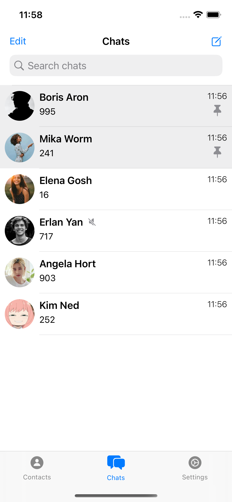
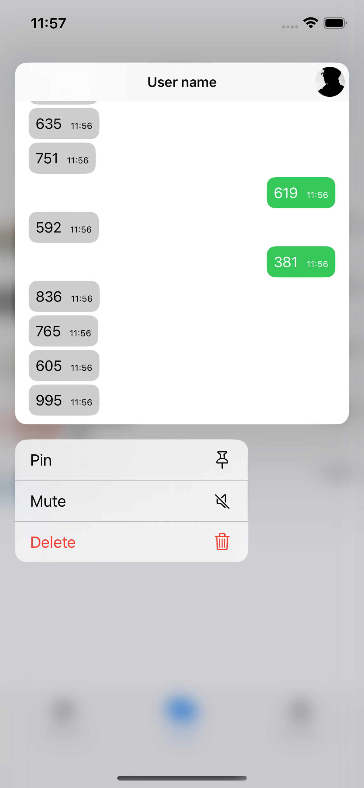
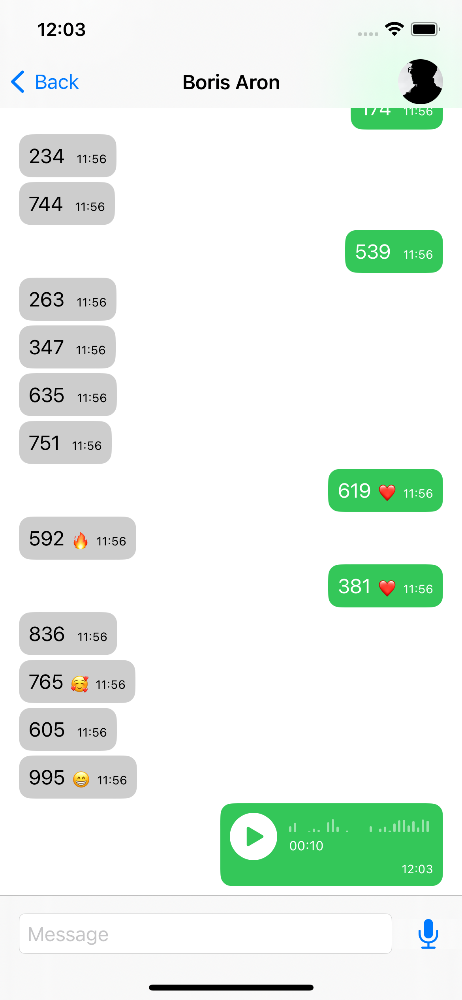
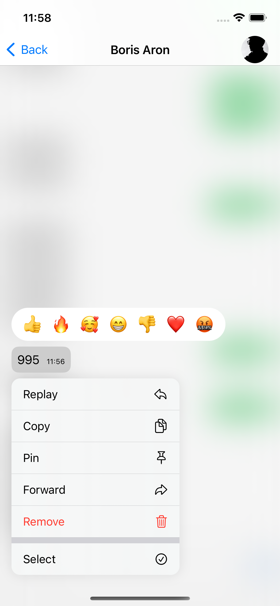
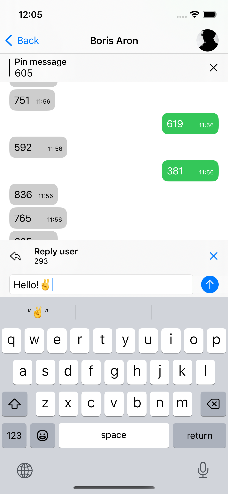
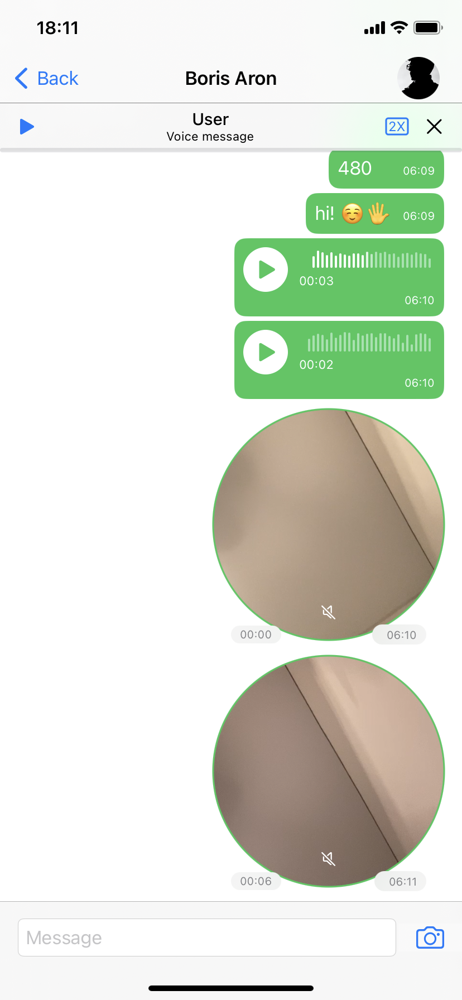
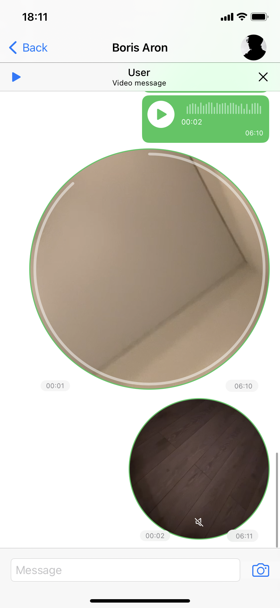
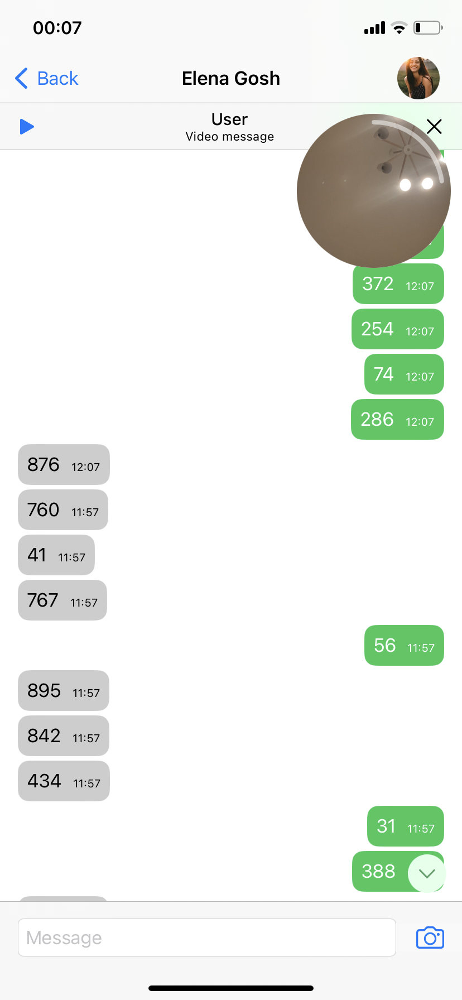

# SimpleChat

### Simple message chat app

An application written in SwiftUI + Combine MVVM. Without a backend, replicates the basic functions of a telegram app.

MVVM Architecture, iOS 15+, device: iphone.
 
## Features:
- Text messages
- Voice messages
- Circle video message
- Reactions
- Chat action (pin, delete, archive mute)
- Dialog actions (reply, copy, pin, forward, select, delete, edit)
- Swipe message to replay

## Includes
- SwiftUI
- Combine Framework
- AVKit
- AVFoundation

## Video 📷

### Chats and dialog actions

  

### Voice and video message

  

## Screenshots 📷

 

 
 

   

   

## Author
* [Bogdan Zykov](https://github.com/BogdanZyk)

###

